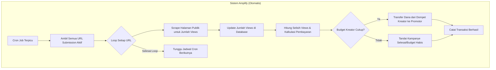

# Product Requirements Document (PRD): Amplify

**Versi:** 1.0
**Tanggal:** 6 Juni 2025
**Penulis:** Roo (Senior Product Manager / Full-Stack Developer)

---

## 1. Pendahuluan

### 1.1. Visi Produk
Menjadi platform marketplace terdepan di Asia Tenggara yang memberdayakan kreator konten untuk memperluas jangkauan mereka secara efisien dan terukur, sambil memberikan peluang penghasilan yang fleksibel bagi para talenta digital (Promotor).

### 1.2. Masalah yang Diselesaikan
Kreator konten, terutama yang sedang berkembang, sering kesulitan untuk menjangkau audiens baru di luar platform utama mereka. Proses mengedit ulang konten panjang menjadi klip pendek yang viral untuk platform seperti TikTok, Reels, dan Shorts memakan waktu dan tidak efisien. Di sisi lain, banyak individu berbakat (editor, pemasar digital) yang memiliki keahlian untuk membuat konten viral tetapi tidak memiliki akses yang mudah ke materi atau peluang yang terstruktur.

Amplify menjembatani kesenjangan ini dengan menciptakan ekosistem simbiosis di mana kreator dapat "mengamplifikasi" konten mereka melalui jaringan promotor yang dibayar berdasarkan kinerja nyata (jumlah penonton), bukan biaya tetap yang berisiko.

### 1.3. Target Pasar
*   **Kreator Konten:** YouTuber, podcaster, streamer game, dan pembuat konten lainnya yang ingin meningkatkan visibilitas dan pertumbuhan audiens di platform video vertikal.
*   **Promotor:** Mahasiswa, pekerja lepas, editor video, dan penggemar media sosial yang ingin memonetisasi waktu dan kreativitas mereka dengan mengedit dan mempromosikan konten.

---

## 2. Persona & User Stories

### 2.1. Persona

*   **Budi - Kreator Konten (YouTuber Gaming)**
    *   **Latar Belakang:** Memiliki channel YouTube dengan 50.000 subscriber. Konten utamanya adalah video gameplay berdurasi panjang (20-30 menit).
    *   **Tujuan:** Meningkatkan jumlah penonton dan pelanggan di channel utamanya. Ingin memanfaatkan tren video vertikal di TikTok dan Reels tapi tidak punya waktu untuk mengedit ulang semua videonya.
    *   **Kebutuhan:** Sebuah cara efisien untuk mendistribusikan cuplikan video mentahnya kepada orang-orang yang bisa mengubahnya menjadi klip viral. Dia ingin membayar berdasarkan hasil (views), bukan biaya tetap per video, dan butuh sistem pelacakan yang transparan.

*   **Citra - Promotor (Mahasiswa & Pengguna Aktif TikTok)**
    *   **Latar Belakang:** Mahasiswa desain komunikasi visual yang sangat aktif di TikTok. Paham tren, musik, dan gaya editing yang sedang viral.
    *   **Tujuan:** Mendapatkan penghasilan tambahan yang fleksibel di sela-sela waktu kuliah.
    *   **Kebutuhan:** Akses mudah ke berbagai materi konten dari kreator yang menarik. Dia butuh instruksi yang jelas, kebebasan berkreasi, dan sistem pembayaran yang dapat diandalkan dan transparan.

### 2.2. User Stories

#### Kreator (Budi)
*   **Sebagai seorang Kreator,** saya ingin bisa mendaftar dan membuat profil, **agar** saya bisa mulai menggunakan platform Amplify.
*   **Sebagai seorang Kreator,** saya ingin bisa membuat "Kampanye Amplifikasi" dengan menetapkan total budget dan tarif per 1000 views, **agar** saya bisa mengontrol biaya akuisisi penonton secara presisi.
*   **Sebagai seorang Kreator,** saya ingin bisa menyediakan aset konten dengan mudah (misal: link Google Drive atau video YouTube), **agar** Promotor bisa langsung mengakses materi untuk diedit.
*   **Sebagai seorang Kreator,** saya ingin bisa menetapkan syarat dan ketentuan yang jelas untuk setiap kampanye (durasi, format, hashtag), **agar** hasil editan Promotor sesuai dengan citra brand saya.
*   **Sebagai seorang Kreator,** saya ingin bisa melakukan top-up saldo dengan mudah melalui payment gateway, **agar** kampanye saya bisa berjalan tanpa hambatan.
*   **Sebagai seorang Kreator,** saya ingin memiliki dashboard untuk memantau sisa budget, jumlah video yang disubmit, dan total views yang dihasilkan, **agar** saya bisa mengukur ROI dari setiap kampanye.

#### Promotor (Citra)
*   **Sebagai seorang Promotor,** saya ingin bisa mendaftar dan membuat profil, **agar** saya bisa menemukan peluang penghasilan.
*   **Sebagai seorang Promotor,** saya ingin bisa menjelajahi marketplace kampanye dan memfilternya berdasarkan tarif atau kategori, **agar** saya bisa menemukan proyek yang paling sesuai dengan minat dan potensi penghasilan saya.
*   **Sebagai seorang Promotor,** saya ingin bisa mengunduh materi kampanye dan melihat syarat & ketentuan dengan jelas, **agar** saya tahu apa yang diharapkan dari saya.
*   **Sebagai seorang Promotor,** saya ingin bisa men-submit link video TikTok/Reels/Shorts yang sudah saya buat, **agar** performanya bisa dilacak oleh sistem.
*   **Sebagai seorang Promotor,** saya ingin memiliki dashboard untuk melihat status verifikasi, jumlah views yang ter-track, dan total pendapatan saya, **agar** saya merasa prosesnya transparan.
*   **Sebagai seorang Promotor,** saya ingin bisa menarik (withdraw) penghasilan saya ke rekening bank dengan mudah, **agar** saya bisa menikmati hasil kerja keras saya.

---

## 3. Daftar Fitur Rinci

1.  **Autentikasi & Manajemen Profil (MVP)**
    *   Pendaftaran dengan email/password.
    *   Pemilihan peran saat mendaftar (Kreator / Promotor).
    *   Login menggunakan Supabase Auth.
    *   Halaman profil untuk mengedit nama, foto profil, dan deskripsi singkat.
    *   Middleware untuk melindungi rute spesifik peran.

2.  **Manajemen Kampanye (Kreator - MVP)**
    *   Form pembuatan kampanye (Judul, Deskripsi, Total Budget, Tarif per 10k views).
    *   Input untuk link aset (Google Drive, YouTube, dll).
    *   Text area untuk Syarat & Ketentuan.
    *   CRUD (Create, Read, Update, Delete) untuk kampanye.
    *   Halaman "Kampanye Saya" untuk melihat daftar kampanye yang dibuat.

3.  **Marketplace & Partisipasi (Promotor - MVP)**
    *   Halaman marketplace untuk melihat semua kampanye aktif dalam bentuk kartu.
    *   Fitur pencarian sederhana.
    *   Halaman detail kampanye untuk melihat semua informasi dan S&K.
    *   Tombol "Ikut Kampanye".
    *   Form untuk submit URL video yang sudah diunggah.

4.  **Sistem Saldo & Pembayaran (V1)**
    *   Dompet virtual (tabel `wallets` di Supabase) untuk setiap pengguna.
    *   Integrasi dengan Payment Gateway (Midtrans/Xendit) untuk top-up saldo Kreator.
    *   Halaman withdrawal untuk Promotor (memasukkan data rekening bank).
    *   Tabel `transactions` untuk mencatat semua pergerakan dana (top-up, pembayaran, withdrawal).
    *   Transaksi harus bersifat atomik untuk menjaga konsistensi data.

5.  **Pelacakan & Verifikasi Performa (V1 - Fitur Kunci)**
    *   **Submission:** Promotor submit URL (TikTok, IG Reels, YT Shorts).
    *   **Pelacakan Otomatis:**
        *   Supabase Edge Function dijadwalkan (cron job) berjalan setiap beberapa jam.
        *   Fungsi ini akan melakukan *scraping* ke URL yang disubmit untuk mengambil data jumlah *views*.
        *   Data *views* terbaru disimpan di tabel `submissions`.
    *   **Logika Pembayaran Otomatis:**
        *   Edge Function lain (atau bagian dari fungsi yang sama) akan dipicu setelah data *views* diperbarui.
        *   Fungsi ini menghitung selisih *views* baru sejak pengecekan terakhir.
        *   Menghitung pembayaran (`selisih_views` / `tarif_views` * `tarif_pembayaran`).
        *   Memindahkan dana dari dompet Kreator ke dompet Promotor jika budget masih tersedia.
        *   Semua proses ini dicatat sebagai transaksi baru.

6.  **Dashboard Analitik (V1.1)**
    *   **Dashboard Kreator:** Grafik tren total *views*, sisa budget, daftar Promotor teratas, performa per kampanye.
    *   **Dashboard Promotor:** Grafik total pendapatan, daftar pendapatan per video, status withdrawal.

7.  **Panel Admin (V1.1)**
    *   Halaman internal untuk melihat daftar pengguna dan kampanye.
    *   Fitur untuk menonaktifkan pengguna atau kampanye yang bermasalah.
    *   Mekanisme untuk menyelesaikan sengketa (misal: menandai transaksi sebagai "disputed").

---

## 4. Alur Pengguna (Flowcharts)

### 4.1. Alur Pembuatan Kampanye (Kreator)

```mermaid
graph TD
    A[Kreator Login] --> B{Dashboard Kreator};
    B --> C[Klik "Buat Kampanye Baru"];
    C --> D[Isi Form Kampanye: Judul, Budget, Tarif, S&K];
    D --> E[Sediakan Link Aset];
    E --> F{Cek Saldo};
    F -- Saldo Cukup --> G[Terbitkan Kampanye];
    F -- Saldo Kurang --> H[Halaman Top-Up Saldo];
    H --> I[Integrasi Payment Gateway];
    I --> G;
    G --> J[Kampanye Muncul di Marketplace];
```

### 4.2. Alur Partisipasi & Submission (Promotor)

```mermaid
graph TD
    A[Promotor Login] --> B[Buka Marketplace Kampanye];
    B --> C[Pilih Kampanye];
    C --> D[Baca Detail & S&K];
    D --> E[Klik "Ikut Kampanye"];
    E --> F[Unduh/Akses Aset Kreator];
    F --> G[Edit & Unggah Video ke Platformnya (TikTok/Reels)];
    G --> H[Salin URL Video];
    H --> I[Submit URL di Halaman Kampanye Amplify];
    I --> J[Submission Tercatat & Menunggu Verifikasi Views];
```

### 4.3. Alur Pelacakan & Pembayaran Otomatis



---

## 5. Non-Functional Requirements

*   **Keamanan:**
    *   Semua data pengguna harus dienkripsi saat transit dan istirahat.
    *   Implementasi RLS (Row Level Security) di Supabase untuk memastikan pengguna hanya bisa mengakses data mereka sendiri.
    *   Proteksi terhadap serangan umum (XSS, CSRF).
*   **Performa:**
    *   Waktu muat halaman (First Contentful Paint) harus di bawah 2 detik.
    *   Respons API harus di bawah 500ms untuk permintaan umum.
    *   Optimasi gambar dan aset frontend.
*   **Skalabilitas:**
    *   Arsitektur serverless (Supabase & Vercel) memungkinkan skalabilitas otomatis.
    *   Proses *scraping* harus dirancang agar tidak membebani sistem dan dapat di-distribusikan jika perlu.
*   **Ketersediaan:**
    *   Platform harus memiliki uptime minimal 99.5%.

---

## 6. Strategi Monetisasi

Platform "Amplify" akan mengambil **potongan sebesar 10%** dari setiap pembayaran yang berhasil ditransfer dari Kreator ke Promotor.

*   **Contoh:** Jika Promotor menghasilkan pembayaran sebesar Rp 10.000, maka:
    *   Promotor akan menerima Rp 9.000.
    *   Amplify akan mendapatkan Rp 1.000 sebagai pendapatan.

Model ini memastikan bahwa platform hanya menghasilkan uang ketika para penggunanya (baik Kreator maupun Promotor) juga mendapatkan nilai.