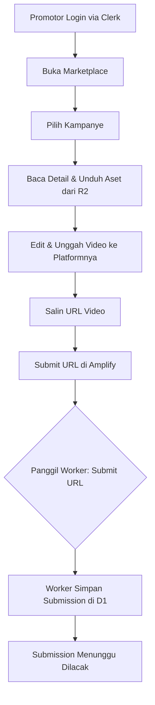
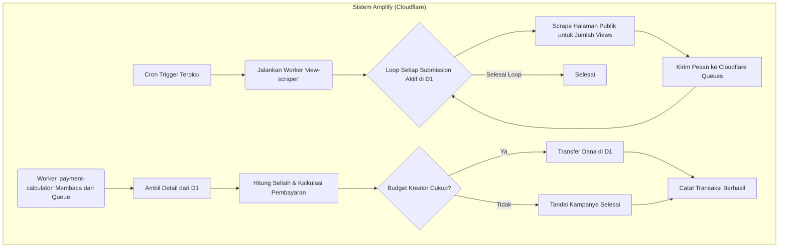

# Product Requirements Document (PRD): Amplify on Cloudflare

**Versi:** 2.0
**Tanggal:** 6 Juni 2025
**Penulis:** Roo (Senior Product Manager / Full-Stack Developer)

---

## 1. Pendahuluan

### 1.1. Visi Produk
Menjadi platform marketplace terdepan di Asia Tenggara yang memberdayakan kreator konten untuk memperluas jangkauan mereka secara efisien dan terukur, sambil memberikan peluang penghasilan yang fleksibel bagi para talenta digital (Promotor).

### 1.2. Masalah yang Diselesaikan
Kreator konten, terutama yang sedang berkembang, sering kesulitan untuk menjangkau audiens baru di luar platform utama mereka. Proses mengedit ulang konten panjang menjadi klip pendek yang viral untuk platform seperti TikTok, Reels, dan Shorts memakan waktu dan tidak efisien. Di sisi lain, banyak individu berbakat (editor, pemasar digital) yang memiliki keahlian untuk membuat konten viral tetapi tidak memiliki akses yang mudah ke materi atau peluang yang terstruktur.

Amplify menjembatani kesenjangan ini dengan menciptakan ekosistem simbiosis di mana kreator dapat "mengamplifikasi" konten mereka melalui jaringan promotor yang dibayar berdasarkan kinerja nyata (jumlah penonton), bukan biaya tetap yang berisiko.

### 1.3. Target Pasar
*   **Kreator Konten:** YouTuber, podcaster, streamer game, dan pembuat konten lainnya yang ingin meningkatkan visibilitas dan pertumbuhan audiens di platform video vertikal.
*   **Promotor:** Mahasiswa, pekerja lepas, editor video, dan penggemar media sosial yang ingin memonetisasi waktu dan kreativitas mereka dengan mengedit dan mempromosikan konten.

---

## 2. Persona & User Stories

### 2.1. Persona

*   **Budi - Kreator Konten (YouTuber Gaming)**
    *   **Latar Belakang:** Memiliki channel YouTube dengan 50.000 subscriber. Konten utamanya adalah video gameplay berdurasi panjang (20-30 menit).
    *   **Tujuan:** Meningkatkan jumlah penonton dan pelanggan di channel utamanya. Ingin memanfaatkan tren video vertikal di TikTok dan Reels tapi tidak punya waktu untuk mengedit ulang semua videonya.
    *   **Kebutuhan:** Sebuah cara efisien untuk mendistribusikan cuplikan video mentahnya kepada orang-orang yang bisa mengubahnya menjadi klip viral. Dia ingin membayar berdasarkan hasil (views), bukan biaya tetap per video, dan butuh sistem pelacakan yang transparan.

*   **Citra - Promotor (Mahasiswa & Pengguna Aktif TikTok)**
    *   **Latar Belakang:** Mahasiswa desain komunikasi visual yang sangat aktif di TikTok. Paham tren, musik, dan gaya editing yang sedang viral.
    *   **Tujuan:** Mendapatkan penghasilan tambahan yang fleksibel di sela-sela waktu kuliah.
    *   **Kebutuhan:** Akses mudah ke berbagai materi konten dari kreator yang menarik. Dia butuh instruksi yang jelas, kebebasan berkreasi, dan sistem pembayaran yang dapat diandalkan dan transparan.

### 2.2. User Stories

#### Kreator (Budi)
*   **Sebagai seorang Kreator,** saya ingin bisa mendaftar dan membuat profil, **agar** saya bisa mulai menggunakan platform Amplify.
*   **Sebagai seorang Kreator,** saya ingin bisa membuat "Kampanye Amplifikasi" dengan menetapkan total budget dan tarif per 1000 views, **agar** saya bisa mengontrol biaya akuisisi penonton secara presisi.
*   **Sebagai seorang Kreator,** saya ingin bisa mengunggah aset konten dengan mudah ke platform, **agar** Promotor bisa langsung mengakses materi untuk diedit.
*   **Sebagai seorang Kreator,** saya ingin bisa menetapkan syarat dan ketentuan yang jelas untuk setiap kampanye (durasi, format, hashtag), **agar** hasil editan Promotor sesuai dengan citra brand saya.
*   **Sebagai seorang Kreator,** saya ingin bisa melakukan top-up saldo dengan mudah melalui payment gateway, **agar** kampanye saya bisa berjalan tanpa hambatan.
*   **Sebagai seorang Kreator,** saya ingin memiliki dashboard untuk memantau sisa budget, jumlah video yang disubmit, dan total views yang dihasilkan, **agar** saya bisa mengukur ROI dari setiap kampanye.

#### Promotor (Citra)
*   **Sebagai seorang Promotor,** saya ingin bisa mendaftar dan membuat profil, **agar** saya bisa menemukan peluang penghasilan.
*   **Sebagai seorang Promotor,** saya ingin bisa menjelajahi marketplace kampanye dan memfilternya berdasarkan tarif atau kategori, **agar** saya bisa menemukan proyek yang paling sesuai dengan minat dan potensi penghasilan saya.
*   **Sebagai seorang Promotor,** saya ingin bisa mengunduh materi kampanye dan melihat syarat & ketentuan dengan jelas, **agar** saya tahu apa yang diharapkan dari saya.
*   **Sebagai seorang Promotor,** saya ingin bisa men-submit link video TikTok/Reels/Shorts yang sudah saya buat, **agar** performanya bisa dilacak oleh sistem.
*   **Sebagai seorang Promotor,** saya ingin memiliki dashboard untuk melihat status verifikasi, jumlah views yang ter-track, dan total pendapatan saya, **agar** saya merasa prosesnya transparan.
*   **Sebagai seorang Promotor,** saya ingin bisa menarik (withdraw) penghasilan saya ke rekening bank dengan mudah, **agar** saya bisa menikmati hasil kerja keras saya.

---

## 3. Daftar Fitur Rinci (Arsitektur Cloudflare)

1.  **Autentikasi & Manajemen Profil (MVP)**
    *   Pendaftaran & Login menggunakan **Clerk**.
    *   Pemilihan peran (Kreator / Promotor) saat mendaftar (custom field di Clerk).
    *   Sinkronisasi data pengguna baru dari Clerk ke database **Cloudflare D1** melalui **Cloudflare Worker** yang berfungsi sebagai webhook.
    *   Halaman profil untuk mengedit data yang tersimpan di D1.
    *   Middleware di Next.js (`authMiddleware` dari Clerk) untuk melindungi rute spesifik peran.

2.  **Manajemen Kampanye (Kreator - MVP)**
    *   Form pembuatan kampanye di frontend (Next.js on Cloudflare Pages).
    *   Logika CRUD ditangani oleh **Cloudflare Worker** yang berinteraksi dengan tabel `campaigns` di **D1**.
    *   Aset kampanye diunggah ke **Cloudflare R2 Storage**.
    *   Halaman "Kampanye Saya" mengambil data dari Worker.

3.  **Marketplace & Partisipasi (Promotor - MVP)**
    *   Halaman marketplace mengambil data kampanye aktif dari Worker.
    *   Form untuk submit URL video memanggil Worker untuk menyimpan data ke tabel `submissions` di D1.

4.  **Sistem Saldo & Pembayaran (V1)**
    *   Dompet virtual (tabel `wallets`) di **D1**.
    *   Integrasi Payment Gateway (Midtrans/Xendit) untuk top-up.
    *   **Cloudflare Worker** berfungsi sebagai webhook endpoint untuk menerima notifikasi pembayaran dan memperbarui saldo di D1.
    *   Logika transfer dana antar dompet diimplementasikan di dalam Worker untuk memastikan atomicity.

5.  **Pelacakan & Verifikasi Performa (V1 - Fitur Kunci)**
    *   **Pelacakan Otomatis:**
        *   **Cloudflare Worker** (`view-scraper`) dijadwalkan menggunakan **Cron Triggers**.
        *   Worker ini melakukan *scraping* ke URL submission untuk mengambil data *views*.
    *   **Logika Pembayaran Asinkron:**
        *   Setelah `view-scraper` mendapatkan data, ia mengirimkan pesan ke **Cloudflare Queues**.
        *   Worker lain (`payment-calculator`) membaca dari Queue, menghitung pembayaran, dan memindahkan dana di D1.

6.  **Dashboard Analitik & Panel Admin (V1.1)**
    *   Semua data untuk dashboard dan panel admin akan disediakan oleh **Cloudflare Workers** yang mengambil data agregat dari **D1**.

---

## 4. Alur Pengguna (Flowcharts)

### 4.1. Alur Pembuatan Kampanye (Kreator)
```mermaid
graph TD
    A[Kreator Login via Clerk] --> B{Dashboard Kreator};
    B --> C[Klik "Buat Kampanye Baru"];
    C --> D[Isi Form & Unggah Aset ke R2];
    D --> E{Panggil Worker: Buat Kampanye};
    E -- Worker Cek Saldo di D1 --> F{Saldo Cukup?};
    F -- Ya --> G[Worker Simpan Kampanye di D1];
    F -- Tidak --> H[Arahkan ke Halaman Top-Up];
    H --> I[Proses via Payment Gateway];
    I -- Webhook ke Worker --> J[Worker Update Saldo di D1];
    J --> G;
    G --> K[Kampanye Muncul di Marketplace];
```

### 4.2. Alur Partisipasi & Submission (Promotor)


### 4.3. Alur Pelacakan & Pembayaran Otomatis (Sistem Cloudflare)


---

## 5. Non-Functional Requirements

*   **Keamanan:**
    *   Otentikasi dan manajemen sesi ditangani oleh **Clerk**.
    *   Validasi kepemilikan data dilakukan secara eksplisit di dalam setiap **Cloudflare Worker**.
    *   Proteksi terhadap serangan umum (XSS, CSRF) di level frontend (Next.js).
*   **Performa:**
    *   Aplikasi disajikan secara global melalui **Cloudflare Pages**.
    *   Logika bisnis dieksekusi di edge oleh **Cloudflare Workers**.
    *   Waktu muat halaman (FCP) < 2 detik. Respons API < 300ms.
*   **Skalabilitas:**
    *   Arsitektur sepenuhnya serverless dan terdistribusi secara global.
    *   **Cloudflare D1, R2, dan Queues** dirancang untuk skala besar.
*   **Ketersediaan:**
    *   Platform harus memiliki uptime minimal 99.9% karena berjalan di atas infrastruktur Cloudflare.

---

## 6. Strategi Monetisasi

Platform "Amplify" akan mengambil **potongan sebesar 10%** dari setiap pembayaran yang berhasil ditransfer dari Kreator ke Promotor. Model ini tetap tidak berubah.